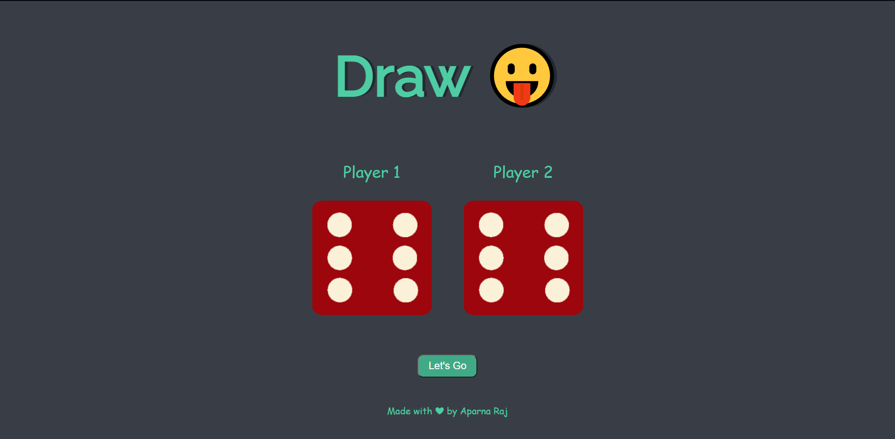

# 🎲 Dice Game
A two player dice game. Once the button "Let's Go" is clicked, random numbers on the two dice are generated and the winner is announced depending on whose die value is greater.

# Deployment
Deployed Website: https://aparnaraj23.github.io/Dice-Game/

# Languages Used
- HTML
- CSS
- Javascript

# Acknowledgments
The Complete 2021 Web Development Bootcamp by Angela Yu.
